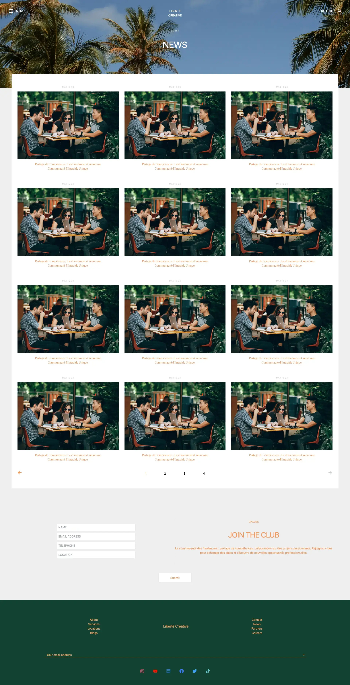

## Use TailwindCSS to structure the layout of the website

 TailwindCSS is very powerful to build the basic structure of a website. Though it can't achieve 100% of CSS, for most of the websites and features that we need, it can do a great job, and it's much more succinct and requires a steep learning curve.

 In TailwindCSS, all styles are added to an element by a class name, which makes it more efficient to change the style in the same HTML/component file. Compared to traditional CSS, Tailwind can save a lot of time to add repetitive styles and makes it very straigtforward to visualise which styles make effects and can be targeted and edited easily.

 There aren't that many things you need to learn in Tailwind to build a basic but still modern styled website. For example, the picture below is all built using TailwindCSS. 

 

To run the project, install dependencies and start the server.

```
npm install
```

```
npm start
```


